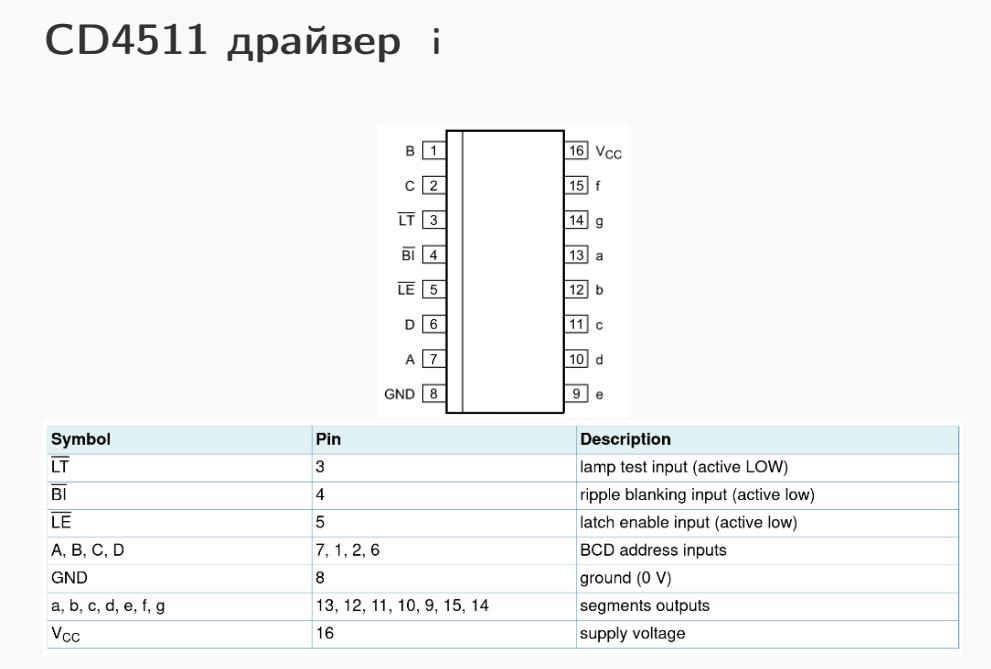

# Embedded Programming

_Любителски Предмет_


## External Interrupts (pin 2 or 3)

- EI**MSK** - could be set INT0 or INT1, used to enable or disable interrupt
- EI**FR** - could be set INTF0, INTF1, used for interrupt state
- EI**CRA** - could be set ISC00/01/10/11, how interrupt should trigger

```c
cli();	// disable interrupts

EIMSK |= (1 << INT0);	// enable external interrupt
EIFR  |= (1 << INTF1);	// clear flag register - if 0 - runs handler
EICRA |= (1 << ISC11);	// when the interrupt should be triggered
EICRA &= ~(1 << ISC10); // continuation of EICRA

sei();	// enable interrupts

...

ISR(INT0_vect) {}	// interrupt handler
```

## Pin Change Interrupts

- PCI**CR** - could be set PCIE2, PCIE1, PCIE0, used for enabling interrupt
- PCI**FR** - could be set PCIF2, PCIF1, PCIF0, used for interrupt state
- PS**MSK**<u>x</u> - x could be 0, 1 or 2, could be set PCINT0-23, used for enabling interrupt for GPIO

```c
cli();

PCICR  |= (1 << PCIE0);
PCIFR  |= (1 << PCIF0);
PCMSK0 |= (1 << PCINT0) | (1 << PCINT1) | (1 << PCINT2) | (1 << PCINT3);
// PCMSK0 could be simplifed to PCMSK0 |= 0b00001111 or 0x0f
    
sei();

ISR(PCINT0_vect) {} // interrupt handler
```

## GPIO with registers

- PORTxn - if input - 1 = pull-up, 0 = no pull-up; if output - 1 = high, 0 = low
- DDRx - if 0 = input; if 1 = output
- PINx - used for reading input pin

```c
// write example
DDRB |= (1 << DDB3); // set pin to output
PORTB |= (1 << PORTB3); // output HIGH
```


```c
// read example
DDRB &= ~(1 << DDB3); // set pin to input
bool output = PINB & (1 << PB3) // read output of
```

## Timers :3

For this course, we will be using only TIMER1, which is a 16-bit timer

- 16-bit PWM
- Auto-Reload
- 2 compare elements

Registers:

- TCINT1 - 16 bit timer counter
- OCR1A/B - output compare registers (16b)
- ICR1 - input capture register (16b)
- TCCR1A/B/C - control registers (8b)
- TIFR1 - interrupt flag register (8b)
- TIMSK1 - interrupt mask register (8b)

OCR1A/B:

- Their values are compared to TCINT1
- Could be used for PWM on pins or to generate an interrupt (not only overflow)

Timer functionality:

- Counter Unit - from BOTTOM to MAX, increments with every clock cycle
- Input Capture - if an interrupt is called the TCINT1 value is saved to ICR1; if ICP1 is set to HIGH, it copies TCINT1 and sets ICF1 to high
- Output Compare Unit - every clock cycle OCR1x and TCINT1 are compared, if equal, OCF1x is set to HIGH, which triggers an interrupt (configured in TIMSK1)
- Compare Match Output - used to set inverted or non-inverted mode (e.g. if inverted 65% PWM should be set to 35%)

Types of timer:

- Normal - from BOTTOM to MAX
- CTC (Clean Timer on Compare) - OCR1A / ICR1 are set to calc TOP, have lower frequency than PWM
- PWM - again (CTC), BOTTOM to TOP, if in non-inverted mode, the pin is set to HIGH, when OCR1x = TCINT1  higher frequency than CTC

The formula for calculating our needed frequency: 

`TOP = ( fclk / N*f ) - 1` or `TOP = ( 16 * 10^6 / N * f )` - set on ICR1

`OCB = (TOP + 1) * DutyCycle%` - set on OCR1B

How to configure a timer:

- Set mode
- Set TOP
- Set N
- Set (non-)inverted

Setting up timer:

```c
// configuring fast-pwm timer
cli();

// reset timer conf
TCCR1A = 0;
TCCR1B = 0;
TCCR1C = 0;
TIMSK1 = 0;
TIFR1 = 0b00100111 // reset TIFR1 by writing 1
// reset timer counter
TCINT1 = 0;

// set tmer to fast-pwm
TCCR1A |= (1 << WGM11);
TCCR1B |= (1 << WGM12 ) | (1 << WGM13);

// set TOP value
ICR1 = 1599; // 10KHz PWM
// set output compare value (for duty cycle)
OCR1B = 400; // 25% DC

// set to non-inverted or inverted mode
TCCR1A |= (1 << COM1B1); // non-inverted
// set when an interrupt should be triggered
TIMSK1 |= (1 << OCIE1B); // interrupt on OCR1B - set to TOIE1 for overflow interrupt
// set N last, due to known bugs
TCCR1B |= (1 << CS10); // here N = 1
    
sei();

...
    
ICR(TIMER1_COMPB_vect) {
	...
}
```

## LED Strips

PIN Change & External Interrupts

```c
#include <Adafruit_NeoPixel.h> 
#define NUM_PIXELS 16
#define PIN 6

Adafruit_NeoPixel strip(NUM_PIXELS, PIN, NEO_GRB + NEO_KHZ800);

volatile int dip = 0;
volatile int pixel = 0;
volatile int green = 0;
volatile int red = 255;
volatile int blue = 0;

void setup()
{
  pinMode(2, INPUT_PULLUP);
  conf_button();
  
  pinMode(A5, INPUT);
  pinMode(A4, INPUT);
  pinMode(A3, INPUT);
  
  conf_dip();
  
  pinMode(PIN, OUTPUT);
  strip.begin();
  
  Serial.begin(9600);
}

void loop()
{
  strip.clear();
  strip.setPixelColor(pixel, strip.Color(green, red, blue));
  strip.show();
  Serial.println(dip);
}

void conf_button() {
	cli();
  	
  	EIMSK |= (1 << INT0);
  	EIFR |= (1 << INTF0);
  	EICRA |= (1 << ISC01);
  	EICRA &= ~(1 << ISC00);
  
  	sei();
}

int read_pot_value(int pin) {
	int pot_value = analogRead(pin);
  	return map(pot_value, 0, 1023, 0, 255);
}

void conf_dip() {
  const uint8_t mask = (1 << DDB0) | (1 << DDB1) | (1 << DDB2) | (1 << DDB3);
  
  DDRB &= ~mask;
  PORTB |= mask;
  
  cli();
  PCMSK0 |= (1 << PCINT0) | (1 << PCINT1) | (1 << PCINT2) | (1 << PCINT3);
  PCICR |= (1 << PCIE0);
  sei();
}

ISR(PCINT0_vect) {
  dip = PINB & ((1 << PINB0) | (1 << PINB1) | (1 << PINB2) | (1 << PINB3));
}

ISR(INT0_vect) {
  pixel = dip;
  green = read_pot_value(A5);
  red = read_pot_value(A4);
  blue = read_pot_value(A3);
}
```


## DC Motors

dunno shit

## 7 Segment Displays

### Normal

### Dynamic

### With Drivers

inv LT (Lamp Test) - selects every segmet

inv BI (Blank Input) - stops every segment 

inv LE (Latch Enable) - show input



## Shift Registers

